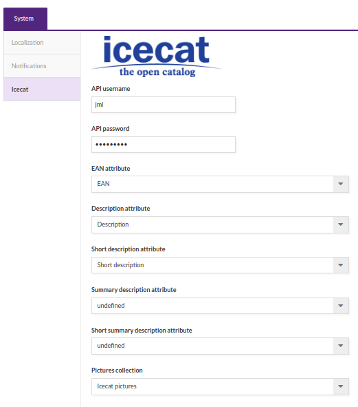

# Icecat Connector extension

The Icecat Connector gives the capability to enrich Akeneo PIM product data with the rich Icecat Catalog. It can be used with both Open free catalog or Full Icecat paid catalog.

## Requirements

| IcecatConnectorBundle | Akeneo PIM Community Edition |
|:---------------------:|:----------------------------:|
| dev-master            | v1.6.*                       |

The Akeneo instance must be conected to the internet to be able to reach the Icecat XML web API.

# Features

This extension allows to enrich an already existing catalog with Icecat catalog data. It does not import any structural content like categories or families.

In order to be able to enrich product data, the existing products must know the corresponding Icecat ID linked to the product.
Existing Akeneo attributes must be mapped to Icecat features with a CSV file containing two main columns: the Akeneo attribute code and the corresponding Icecat feature ID. A import profile is provided by the extension to help in this mapping step.

Once this mapping is done, the products data will be fetched with a cron task using Icecat XML web API.

This extension does not relie on Icecat taxonomy, and so there is no requirements or limitation on the Akeneo catalog structure.
On the other hand, it is not possible to initialize an empty Akeneo with this extension.

## Configuration

The connector provides a configuration screen to set some important informations:
- Icecat product ID: the product attribute containing the Icecat product ID
- Description, Short Description, Summary Description, Short Summary Description: these are common data in the Icecat XML payload and they can be mapped to any Akeneo text attribute.

## Import profiles

There are 3 differents imports profiles in this extension:
- `icecat_download_features`: a profile to download all Icecat featufres and prepare the attributes mapping CSV file.
- `icecat_import_features_mapping`: to upload the final attributes mapping CSV file.
- `icecat_enrich_products`: this profile is used by a CRON task to enrich product content.

