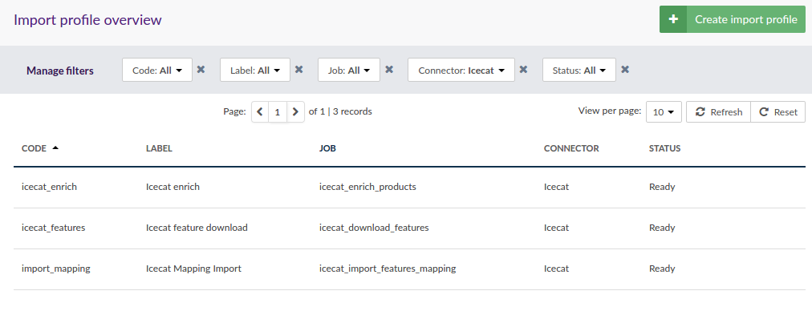

# Icecat Connector extension

The Icecat Connector gives the capability to enrich Akeneo PIM product data with the rich Icecat Catalog. 
It can be used with both Open Icecat free catalog or Full Icecat paid catalog.

## Requirements

| IcecatConnectorBundle | Akeneo PIM Community Edition |
|:---------------------:|:----------------------------:|
| 2.0.*                 | v2.0.*                       |
| 1.2.*                 | v1.7.*                       |
| 1.1.*                 | v1.7.*                       |
| 1.0.*                 | v1.6.*                       |

The Akeneo PIM instance must be connected to the internet to be able to reach the Icecat XML web API.

# Features

This extension allows to enrich an already existing catalog with Icecat catalog data.
It does not import any structural content like categories or families. 
This way you keep control of your catalog structuration and are not tied to Icecat taxonomy.

To enrich your product with Icecat content, you will also need to have a unique attribute containing the product EAN.
This attribute will be used to match Icecat products via their web API.

Existing Akeneo PIM attributes must also be mapped to Icecat features with a CSV file containing two main columns:
the Akeneo attribute code and the corresponding Icecat feature ID.
An import profile is provided by the extension to help in this mapping step.

Once this mapping is done, the products data will be fetched with a mass edit task using Icecat XML web API.

**Important**: This extension does not rely on Icecat taxonomy, and so there is no requirement or limitation on the Akeneo catalog structure.
On the other hand, it is not possible to initialize an empty Akeneo PIM with this extension.

## Configuration


The connector provides a configuration screen to set some important informations:

* Icecat credentials. You can check these credentials in the configuration screen.

* Icecat product EAN: the product attribute containing the Icecat product EAN. This attribute must be unique.

* Description, Short Description, Summary Description, Short Summary Description: these are common data in the Icecat XML payload and they can be mapped to any Akeneo PIM text attribute.

* fallback_locale: Icecat locale used for non localizable attributes in Akeneo.

* fallback_channel: The target channel in Akeneo.

## Import profiles

There are 3 differents imports profiles in this extension:
- `icecat_download_features`: a profile to download all Icecat features and prepare the attributes mapping CSV file.
- `icecat_import_features_mapping`: to upload the final attributes mapping CSV file.
- `icecat_enrich_products`: this profile can be used by a CRON task to enrich product content.



# Installation

## Composer

First, you must require the connector dependencies:

```php
composer require akeneo/icecat-connector 2.0.*
```

## Registering the bundle

### Import routing file

In `app/config/routing.yml`, add the following entry:

```yml
pim_icecat_connector:
    resource: "@PimIcecatConnectorBundle/Resources/config/routing.yml"
    prefix: /icecat
```

### Register dependencies

The Icecat connector uses a new attribute type to store pictures url collection.
You must then activate the dependencies bundles:

In `app/AppKernel.php`:

```php
    protected function registerProjectBundles()
    {
        return [
            new \Pim\Bundle\ExtendedAttributeTypeBundle\PimExtendedAttributeTypeBundle(),
            new \Pim\Bundle\ExtendedMeasureBundle\PimExtendedMeasureBundle(),
            new \Pim\Bundle\IcecatConnectorBundle\PimIcecatConnectorBundle(),
        ];
    }
```

### Add new Mass Operation:
```
bin/console akeneo:batch:create-job "Akeneo Mass Edit Connector" "mass_edit_icecat_enrichment" "mass_edit" "mass_edit_icecat_enrichment"
```

In an Enterpise Edition context, you must also add the corresponding permissions:
https://docs.akeneo.com/2.0/manipulate_pim_data/mass_edition/register_a_new_mass_edit_action.html#phase-6-add-user-groups-permissions-to-job-profiles-enterprise-edition

To facilitate this configuration, the bundle provides a `bin/setup.bash` to make this operations in one command line.

### Mapping between Icecat locales and PIM locales
By default, content in specific language are set into one locale. Here is the existing mapping:

| Icecat locale | PIM Locale
|---------------|-----------
ZH_TW | zh_TW (Chinese - traditional))
EN_SG | en_SG (Singapore English)
EN_IN | en_IN (Indian English)
DE_CH | de_CH (Swiss German)
INT | null (International standardized version)
EN | en_GB (Standard or UK English)
US | en_US (US English)
NL | nl_NL (Dutch)
FR | fr_FR (French)
DE | de_DE (German)
IT | it_IT (Italian)
ES | es_ES (Spanish)
DK | da_DK (Danish)
RU | ru_RU (Russian)
PT | pt_PT (Portuguese)
BR | pt_BR (Brazilian Portuguese)
ZH | zh_CN (Chinese (simplified))
SE | sv_SE (Swedish)
PL | pl_PL (Polish)
CZ | cs_CZ (Czech)
HU | hu_HU (Hungarian)
FI | fi_FI (Finnish)
NO | nn_NO (Norwegian)
TR | tr_TR (Turkish)
BG | bg_BG (Bulgarian)
KA | ka_GE (Georgian)
RO | ro_RO (Romanian)
SR | sr_RS (Serbian)
JA | ja_JP (Japanese)
UK | uk_UA (Ukrainian)
CA | ca_ES (Catalan)
HR | hr_HR (Croatian)
AR | ar_SA (Arabic (Saudi Arabia))
VI | vi_VN (Vietnamese)
HE | he_IL (Hebrew)
KO | ko_KR (Korean)
LT | lt_LT (Lithuanian)
LV | lv_LV (Latvian)
ID | id_ID (Indonesian)
SK | sk_SK (Slovakian)

### Update the DB schema

One way to this is using the command `bin/console doctrine:schema:update`.
You will have to specify an option for this command:

* `dump-sql` will show you the changes without applying them.

* `force` will apply the changes.

## (optional) Fixtures examples

This extension provides examples fixtures for attributes and family.
They are meant to be used in conjunction with the PimInstallerBundle:icecat_demo_dev.

Once your application is installed with the `icecat_demo_dev` data, you can load these attributes and family with the
shipped import profiles `attributes_csv_import` and `family_csv_import`.

## Build attributes mappings

This is a big setup step. The operation consists in mapping Akeneo attributes on Icecat features.
This can be splitted in three steps:

* download the full Icecat features CSV file. It provides an empty CSV file ready for the mapping.

* map needed features ID with Akeneo attributes codes in the CSV file. 
  This step can be very long if you have many attributes to map.

* upload the CSV mapping.

You will find more documentation on mapping in the [docs folder](docs/mapping.md).

## Enrich products  

The extension provides an `icecat_enrich_products` job that can be used manually or in a cron task via a dedicated import profile.
This import profile will check all products with an Icecat EAN attribute and call the Icecat API to get the data.
