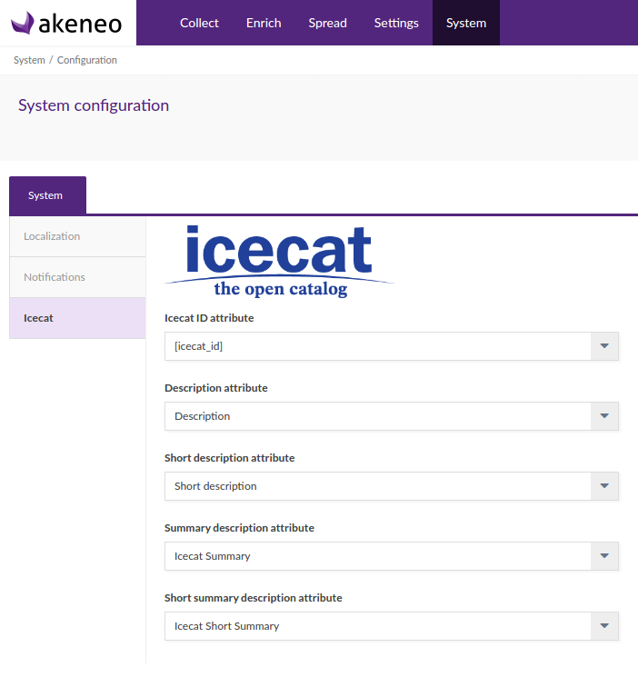

# Icecat Connector extension

The Icecat Connector gives the capability to enrich Akeneo PIM product data with the rich Icecat Catalog. It can be used with both Open Icecat free catalog or Full Icecat paid catalog.

## Requirements

| IcecatConnectorBundle | Akeneo PIM Community Edition |
|:---------------------:|:----------------------------:|
| 1.1.*, dev-master     | v1.7.*                       |
| 1.0.*                 | v1.6.*                       |

The Akeneo PIM instance must be connected to the internet to be able to reach the Icecat XML web API.

# Features

This extension allows to enrich an already existing catalog with Icecat catalog data. It does not import any structural content like categories or families. This way you keep control of your catalog structuration and are not tied to Icecat taxonomy.

To enrich your product with Icecat content, you will also needs to have a unique attribute containing the product EAN. This attribute will be used to match Icecat product via their web API.

Existing Akeneo PIM attributes must also be mapped to Icecat features with a CSV file containing two main columns: the Akeneo attribute code and the corresponding Icecat feature ID. An import profile is provided by the extension to help in this mapping step.

Once this mapping is done, the products data will be fetched with a cron task using Icecat XML web API.

**Important**: This extension does not rely on Icecat taxonomy, and so there is no requirement or limitation on the Akeneo catalog structure.
On the other hand, it is not possible to initialize an empty Akeneo PIM with this extension.

## Configuration



The connector provides a configuration screen to set some important informations:
- Icecat product EAN: the product attribute containing the Icecat product EAN. This attribute must be unique.
- Description, Short Description, Summary Description, Short Summary Description: these are common data in the Icecat XML payload and they can be mapped to any Akeneo PIM text attribute.

## Import profiles

There are 3 differents imports profiles in this extension:
- `icecat_download_features`: a profile to download all Icecat features and prepare the attributes mapping CSV file.
- `icecat_import_features_mapping`: to upload the final attributes mapping CSV file.
- `icecat_enrich_products`: this profile is used by a CRON task to enrich product content.


# Installation

## Composer

First, you must require the connector dependencies:

```php
composer config repositories.icecat '{"type": "vcs", "url": "ssh://git@distribution.akeneo.com:443/IcecatConnector", "branch": "master"}'
composer require akeneo/icecat-connector 1.1.*
```

## Override product value model

Activate the dependencies bundles:

In `app/AppKernel.php`:

```php
    protected function registerProjectBundles()
    {
        return [
            new \Pim\Bundle\ExtendedAttributeTypeBundle\PimExtendedAttributeTypeBundle(),
            new \Pim\Bundle\ExtendedMeasureBundle\PimExtendedMeasureBundle(),
            new \Pim\Bundle\IcecatConnectorBundle\PimIcecatConnectorBundle(),
        ];
    }
```

### (Optionnal) Example bundles

This connector is shipped with complete example bundle, especially to override the ProductValue model.
This is needed to use the new TextCollection attribute type.

The easiest way to enable it is to use a symbolic link:

```
cd src
ln -s ../vendor/akeneo/extended-attribute-type/doc/example/Pim Pim
```

After that, you will be able to use the example bundles in `app/AppKernel.php`:

```php
    protected function registerProjectBundles()
    {
        return [
            new \Pim\Bundle\ExtendedAttributeTypeBundle\PimExtendedAttributeTypeBundle(),
            new \Pim\Bundle\ExtendedMeasureBundle\PimExtendedMeasureBundle(),
            new \Pim\Bundle\IcecatConnectorBundle\PimIcecatConnectorBundle(),
            new \Pim\Bundle\ExtendedCeBundle\ExtendedCeBundle(),   // example CE bundle to activate the extended attributes
            //new \Pim\Bundle\ExtendedEeBundle\ExtendedEeBundle(), // example EE bundle to activate the extended attributes
        ];
    }
```

## (optionnal) Fixtures examples

This extension provides examples fixtures for attributes and family.
They are meant to be used in conjonction with the PimInstallerBundle:icecat_demo_dev.

Once your application is installed with the `icecat_demo_dev` data, you can load these attributes and family with the
shipped import profiles `attributes_csv_import` and `family_csv_import`.

## Extension configuration

Configure the Icecat credentials and special attributes in the PIM configuration screen.

## Build attributes mappings

This is a big setup step.
*TODO*
